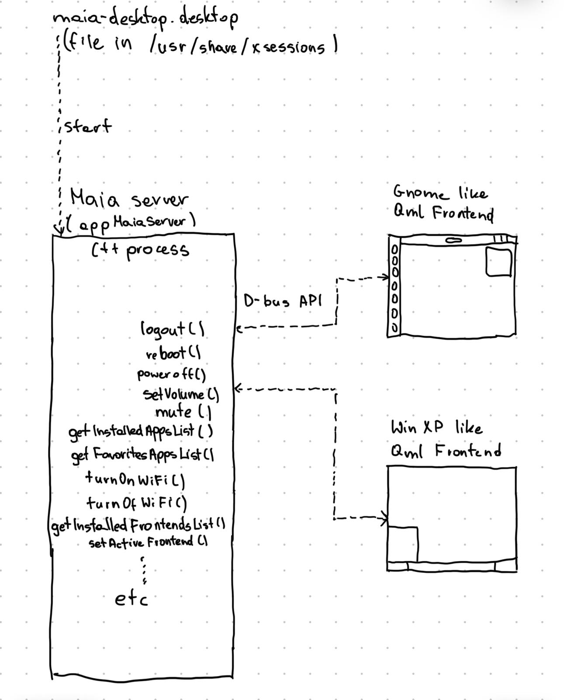

# Maia Shell

## Overview

Maia Shell is a lightweight, modular graphical shell for Linux, built with C++ and QML. It features a unique split architecture, inspired by web technologies, separating the backend from the frontend. With Maia Shell, you can seamlessly switch between different frontend designs, such as Windows XP-inspired or GNOME-like layouts, all connected to a single, robust backend.

## Limitations

Maia Shell is an experimental proof-of-concept project. It supports basic functionality, including launching applications, managing a favorites list, session control (logout, reboot, shutdown), volume control, muting, and a functional taskbar. However, many features are not yet implemented, such as wallpaper settings, Wi-Fi and Bluetooth management. It currently supports only single-monitor setups and has been tested solely at FHD (1920x1080) resolution. This shell is ideal for enthusiasts who enjoy experimenting with early-stage software, but it is not a production-ready desktop environment.

## Maia Shell in action

[](https://www.youtube.com/watch?v=UC_YpOu7KqA)
<!-- Generated by https://t.cuts.so/github/video -->

## System Requirements

Maia Shell v0.1.0 has been tested on Ubuntu 22.04 or later, but it may work on other Linux distributions as well.


## Instalation

To install Maia Shell on Ubuntu, follow these steps:

1. **Install dependencies:**

```bash
sudo apt install --no-install-recommends --no-install-suggests kwin-x11
sudo apt install --no-install-recommends --no-install-suggests kwin-common
sudo apt install --no-install-recommends --no-install-suggests kwin-data
sudo apt install --no-install-recommends --no-install-suggests kwin-addons
sudo apt install --no-install-recommends --no-install-suggests libkf5globalaccel-bin breeze libkf5kcmutils5
```
2. **Download and install:**
	* Download the latest release package from GitHub.
	* Unzip the package and navigate to the extracted directory.
	* Run the installation script:

```bash
chmod +x install_on_ubuntu.sh
sudo ./install_on_ubuntu.sh
```

3. **Start Maia Shell:**
	- Log out of your current session.
	- Select the "Maia" session from your login manager and log in.
	
	
	
## Basic Architecture




