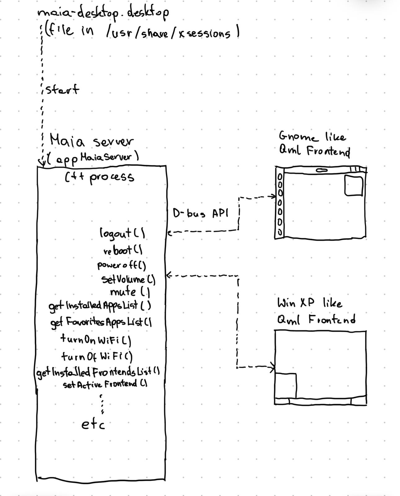
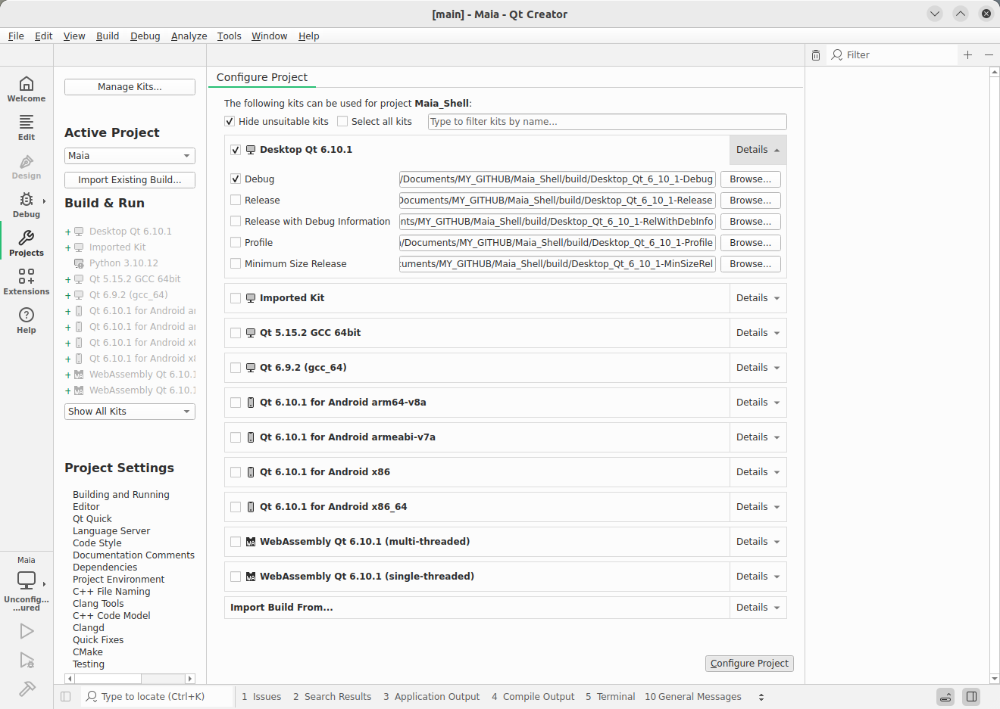
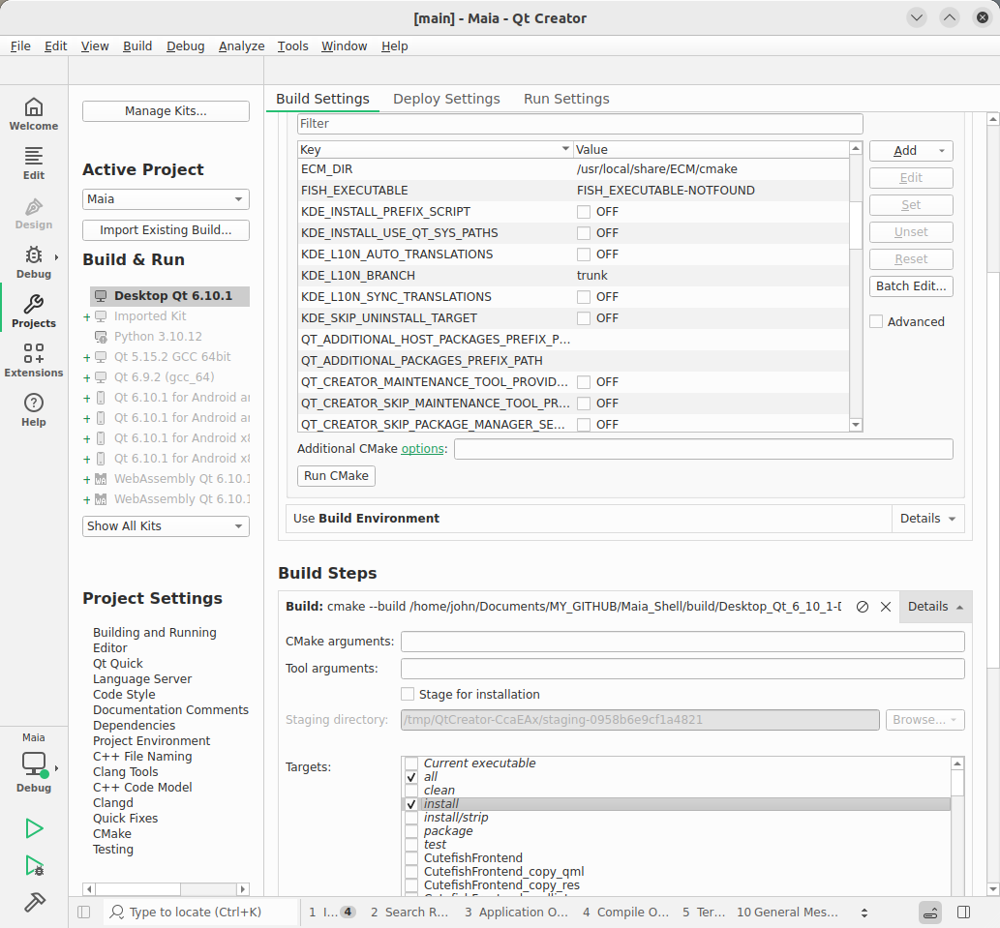
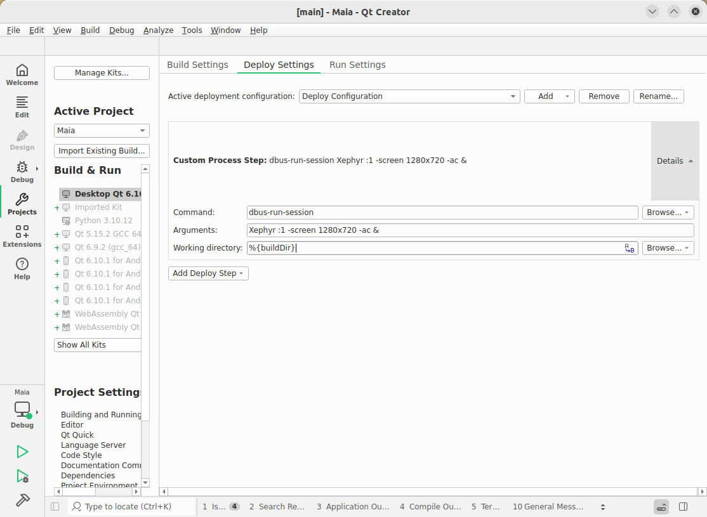
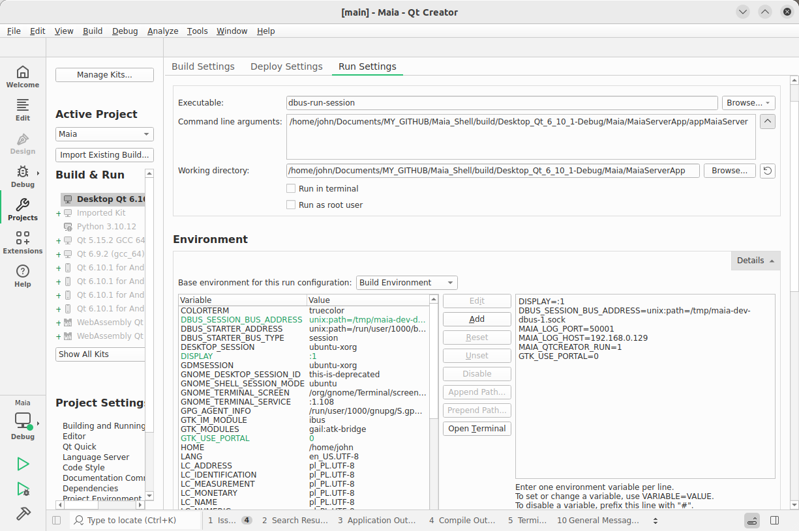

# Maia Shell

## Overview

Maia Shell is a lightweight, modular graphical shell for Linux, built with C++ and QML. It features a unique split architecture, inspired by web technologies, separating the backend from the frontend. With Maia Shell, you can seamlessly switch between different frontend designs, such as Windows XP-inspired or GNOME-like layouts, all connected to a single, robust backend.

## 📱 Social Media

- **[Discord](https://discord.gg/ySdhVz9Fn)**
- **[YouTube](https://www.youtube.com/@MaiaShell)**

## Limitations

Maia Shell is an experimental proof-of-concept project. It supports basic functionality, including launching applications, managing a favorites list, session control (logout, reboot, shutdown), volume control, muting, and a functional taskbar. However, many features are not yet implemented, such as wallpaper settings, Wi-Fi and Bluetooth management. It currently supports only single-monitor setups and has been tested solely at FHD (1920x1080) resolution. This shell is ideal for enthusiasts who enjoy experimenting with early-stage software, but it is not a production-ready desktop environment.

## Maia Shell in action on YouTube

[](https://www.youtube.com/watch?v=UC_YpOu7KqA)


## System Requirements

Maia Shell v0.1.0 has been tested on Ubuntu 22.04, 24.04, 25.04, but it may work on other Linux distributions as well.

## Supported Platforms
| Maia Shell | OS | Qt | KDE Framework
| :--- | :---: | :--- |:---|
|0.1.0 | Ubuntu 22.04 24.04, 25.04 | 6.9.2 | 6.9.0

## Logger

Maia Shell includes a dedicated, network-based logging application. It operates on a client-server architecture: the Logger application acts as a server, and Maia Shell connects to it as a client upon startup to stream log data over the network. This setup is highly beneficial for debugging, especially when troubleshooting startup issues. 

The Logger application is cross-platform and can be compiled and run on Linux, Windows, and Android.

### Running the Bundled Logger (Linux)

The pre-compiled Linux version of the Logger is bundled with the Maia Shell installation packages. It is located at `/opt/Maia/Maia_X.Y.Z/bin/appLogger`. 

For your convenience, a startup script is provided in the same directory. You can launch it by running:

```bash
cd /opt/Maia/Maia_X.Y.Z/bin/
./run_logger.sh
```

### Building the Logger for Windows / Android

Running the Logger on a separate device (such as a Windows PC or an Android smartphone) can be very convenient for monitoring logs during development without cluttering your main workspace.

To compile and run the Logger on another platform:

1. Clone the Maia Shell repository.
2. **Crucial:** Checkout the Git tag that exactly matches your installed version of Maia Shell. *(The communication protocol between the client and server may change between versions, so version parity is required).*
3. Open the Logger project in Qt Creator. The project file is located at: `[Maia repository]/Maia/LoggerApp/CMakeLists.txt`.
4. Configure the project with the appropriate Qt version for your target platform.
5. Compile and run the application.

### Configuring Maia Shell (The Client)

Since the Logger acts as a server, you must configure Maia Shell with the target IP address and port to establish the connection. 

The application supports a specific port range: **50000 to 50009**. Providing 10 distinct channels is extremely useful during development. For instance, you can run your primary Maia Shell instance on one port, and simultaneously run a development instance (via Qt Creator and Xephyr) on another. This ensures that log streams from different instances do not conflict.

To configure the connection, you need to set two environment variables: `MAIA_LOG_HOST` and `MAIA_LOG_PORT`. 

If you are running Maia Shell as your primary desktop environment, you can set these variables in the session `.desktop` file located at `/usr/share/xsessions/maia_X.Y.Z-desktop.desktop`. Simply append the variables to the `Exec` line.

**Example `maia_X.Y.Z-desktop.desktop` configuration:**

```ini
[Desktop Entry]
Name=Maia 0.1.0
Comment=Desktop Environment using Qt
Exec=env LD_LIBRARY_PATH=/opt/Maia/Maia_0.1.0/lib GTK_USE_PORTAL=0 MAIA_LOG_PORT=50001 MAIA_LOG_HOST=10.34.204.173 /opt/Maia/Maia_0.1.0/bin/appMaiaServer
Type=Application
```

## Instalation

To install Maia Shell on Ubuntu, follow these steps:

1. **Install dependencies:**

```bash
sudo apt update
sudo apt install --no-install-recommends --no-install-suggests kwin-x11
sudo apt install --no-install-recommends --no-install-suggests kwin-common
sudo apt install --no-install-recommends --no-install-suggests kwin-data
sudo apt install --no-install-recommends --no-install-suggests kwin-addons
sudo apt install --no-install-recommends --no-install-suggests libkf5globalaccel-bin breeze libkf5kcmutils5
```
2. **Download and install:**
	* Download the latest release package from GitHub.
	* Unzip the package and navigate to the extracted directory.
	* Run the installation script:

```bash
chmod +x install_on_ubuntu.sh
sudo ./install_on_ubuntu.sh
```

3. **Start Maia Shell:**
	- Log out of your current session.
	- Select the "Maia" session from your login manager and log in.
	
	
	
## Basic Architecture



## Enviroment variables

**MAIA_FRONTENDS_PATH**=/opt/Maia/Maia_0.1.0/frontends/
**MAIA_LOG_PORT**=50001
**MAIA_LOG_HOST**=192.168.0.129


## Contribution

### Build Maia Shell 0.2.0 from sources

System requrements: Ubuntu 26.04, Maia Shell 0.2.0

1. Install dependencies
```bash
sudo apt update

sudo apt install -y git gitk

sudo apt install -y \
    build-essential \
    cmake \
    cmake-doc \
    cmake-format \
    elpa-cmake-mode \
    ninja-build \
    pkg-config \
    extra-cmake-modules

sudo apt install -y \
    qtcreator \
    qtcreator-data \
    qtcreator-doc


sudo apt install -y \
    qt6-base-dev \
    qt6-base-dev-tools \
    qt6-base-private-dev \
    qt6-base-examples \
    qt6-declarative-dev \
    qt6-declarative-examples \
    qt6-wayland-dev \
    qt6-scxml-dev \
    qt6-svg-dev \
    qt6-webengine-dev \
    qt6-websockets-dev \
    qt6-quick3d-dev

sudo apt install -y \
    libkf6kcmutils-dev \
    libkf6windowsystem-dev \
    libkf6pulseaudioqt-dev

sudo apt install -y \
    libwayland-dev \
    wayland-protocols \
    libxkbcommon-dev

sudo apt install -y \
    libxcb1-dev \
    libxcb-shape0-dev \
    libxcb-icccm4-dev \
    xserver-xephyr
```

```bash
cd Maia_Shell
mkdir build
cd build
cmake -G Ninja ..
(cmake -G Ninja -DCMAKE_INSTALL_PREFIX=$HOME/Maia_deploy/Maia_0.2.0 ..)
cmake --build .
sudo cmake --install .
```


### Upgrade Qt version

1. Install new Qt version
2. Remove deploy dir: rm -r ~/Maia_deploy/
3. Open CMakeLists.txt (from top level repository dir) in Qt Creator
4. Configure project



5. Setup Build & Run as following



```bash
dbus-run-session
Xephyr :1 -screen 1280x720 -ac &
%{buildDir}
```



```bash
DISPLAY=:1
DBUS_SESSION_BUS_ADDRESS=unix:path=/tmp/maia-dev-dbus-1.sock
MAIA_LOG_PORT=50001
MAIA_LOG_HOST=192.168.0.129
MAIA_FRONTENDS_PATH=%{sourceDir}/Maia/frontends
GTK_USE_PORTAL=0
```

//TODO update config image




